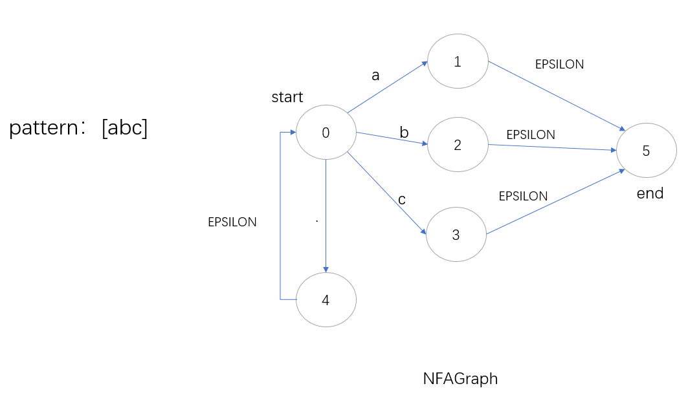
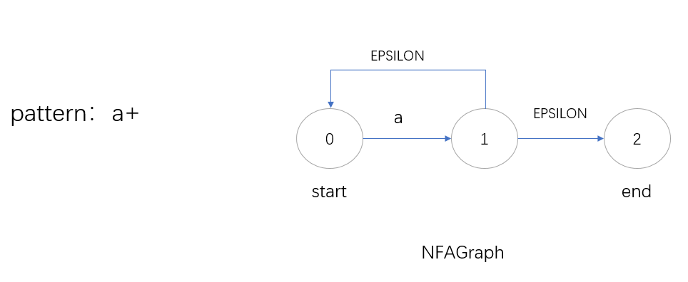
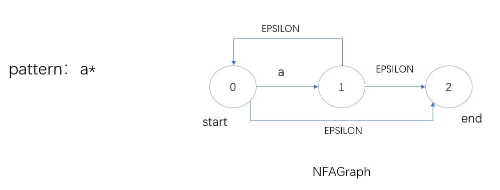
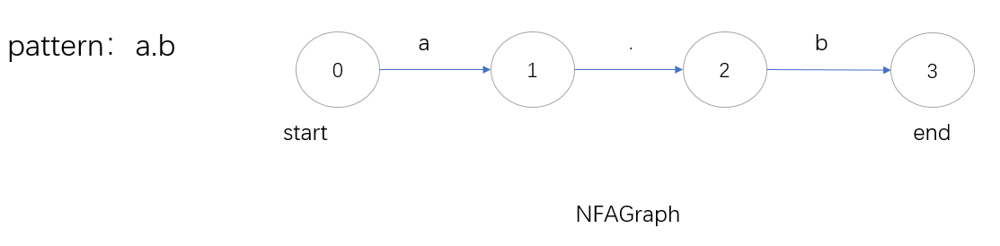

## CPO_lab2

1. title: Computational Process Organization Lab 2
2. group name : 224_NB
3. group member : Ni Yijie 202320064;Sun Qing 202320057
4. laboratory work number: 5a
5. variant description: Regular expression-Sub variants define which construction you should support:
   \w, \s, \d, \, ^, ., $, *, +, [ ], \[^ ], {n}, {min,}, {,max}, {min,max}.
6. synopsis
    
    Design an embedded domain-specific language or a simple text parser.
    Design architecture of a simple interpreter.
    Develop a simple interpreter for a specific model of computation.
    Develop unit tests.
    Develop input data control in the aspect-oriented style.
7. contribution summary for each member
    Ni Yijie completed the data structure design and code writing.
    Sun Qing completed data testing and documentation.
8. work demonstration
    8.1 we use pycharm to write code and test it
    8.2 we use github to control our code version
    8.3 we can run it in terminal
   
   
   
   
9. Conclusion: This experiment completed the conversion and calculation of mathematical expressions. 
   This program makes us know how to design and test regular rules.
